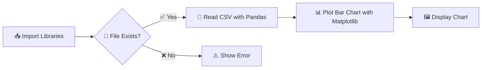

<div align="center">

# 📊 Student Marks Bar Chart

### A clean, beginner-friendly Python project that visualizes student performance using **Pandas** + **Matplotlib**


</div>

---

## ✨ Overview

This project reads student data from a CSV file and turns it into a clear, easy-to-read **bar chart** — perfect for anyone starting out with **data analysis and visualization** in Python.

> 🎯 Built as a hands-on exercise in learning **Pandas** for data handling and **Matplotlib** for visualization.

---

## 🚀 Features

| Feature | Description |
|--------|--------------|
| 📥 CSV Reader | Loads student data directly from a `.csv` file |
| 🛡️ Safety Check | Verifies the file exists before attempting to load it |
| 📊 Bar Chart | Visualizes marks per student instantly |
| 🐼 Pandas Powered | Efficient, readable data handling |
| 🎨 Matplotlib Graphics | Clean, customizable chart rendering |

---

## 📂 Project Structure

```
Student-Marks-Chart/
│
├── 📄 students.csv     # Sample student dataset
├── 🐍 main.py           # Main script to generate the chart
└── 📘 README.md         # Project documentation
```

---

## 🧾 Sample Dataset — `students.csv`

| Name  | Marks | Department | Attendance |
|-------|:-----:|:----------:|:----------:|
| Amit  |  78   |     CS     |     80     |
| Riya  |  65   |     IT     |     90     |
| Rahul |  85   |     CS     |     76     |
| Sneha |  72   |     CS     |     70     |
| Kunal |  90   |    ECE     |     88     |

---

## 🛠 Requirements

Install the required libraries with a single command:

```bash
pip install pandas matplotlib
```

---

## ▶️ How to Run

**1️⃣ Place your CSV file** in the project directory (or update the path below).

**2️⃣ Set the file path** in `main.py`:

```python
csv_path = r"C:\Users\aqwa\Documents\PY\students.csv"
```

**3️⃣ Run the script:**

```bash
python main.py
```

That's it — your chart will pop right up! 🎉

---

## 🧠 How It Works



1. **Import** required libraries
2. **Check** if the CSV file exists
3. **Read** the data using Pandas
4. **Plot** a bar chart of student marks
5. **Display** the final chart

---

## 📊 Sample Output

```
Marks
90 |                     █
85 |              █      █
80 | █            █      █
75 | █            █      █
70 | █      █     █      █
65 | █      █     █      █
    --------------------------------
     Amit  Riya Rahul Sneha Kunal
```

**X-axis:** Student Names  📛
**Y-axis:** Marks  🎯

---

## 📚 Libraries Used

| Library | Purpose |
|---------|---------|
| 🐼 **Pandas** | Reading and handling CSV data |
| 📈 **Matplotlib** | Creating bar charts |
| 🗂️ **OS** | Checking file existence |

---

## 💡 Future Improvements

- [ ] Add more chart types (Pie 🥧, Line 📈, Histogram 📊)
- [ ] Display attendance analysis
- [ ] Compare department-wise average marks
- [ ] Save charts as PNG images 🖼️
- [ ] Add user input for CSV file selection
- [ ] Use **Seaborn** for enhanced visual styling 🎨

---

## 👨‍💻 Author

<div align="left">

**Tushar Magar**
🌱 Learning Python Data Analysis & Visualization using Pandas and Matplotlib

</div>

---

## 📜 License

This project is **open-source** and free to use for educational purposes. 🎓

---

<div align="center">

⭐ **If you found this project helpful, consider giving it a star!** ⭐

</div>
